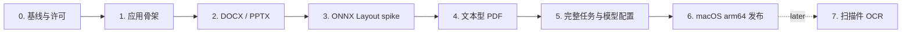

# 迁移路线

> 状态：Draft · 原则：每阶段都有可独立验收的产物

## 总体顺序

Layout spike 提前到 PDF 完整迁移之前。否则先把依赖 Paddle 的 PDF pipeline 搬完，再换 ONNX，只会制造一次确定性的返工——这种顺序没有任何值得维护的浪漫。

## Phase 0：固定源项目基线

### 工作

- 列出 JOTO-Translation 中 DOCX、PPTX、PDF pipeline 的入口、依赖、共享工具和企业耦合点。
- 盘点原 pipeline 的全部提示词、动态插值字段、消息角色和调用位置，固定当前输出行为作为改造基线。
- 建立每种格式的 golden corpus 与结构指标，不只比较“能不能打开”。
- 记录源项目测试基线。前期调研看到 129 个测试通过，但迁移开始前必须在当前 commit 重跑并固定 SHA。
- 建立 copied / adapted / rewritten 来源清单，准备 `THIRD_PARTY_NOTICES`。
- 单独审计 `pdfminerex` 与模型权重的来源和许可证。

### 验收门

- 每段待迁代码都有来源、测试和保留/删除理由。
- 没有来源不明的模型、字体、测试文档或二进制被带入新仓库。

## Phase 1：应用骨架

### 工作

- 建立 `backend/` Python/FastAPI sidecar、`frontend/` React/Vite/Tailwind UI 和 `tauri/` Tauri 2 壳；三个 runtime 分别维护自己的依赖与锁文件。
- 用 CSS variables 固定 PageFerry 视觉 token，只按需引入可直接维护源码的 shadcn/ui 组件。
- 定义软件专属数据目录并初始化 SQLite。
- 提供健康检查和版本化 model catalog 读取 endpoint。
- 固定 lint、format、test、build 命令与 `AGENTS.md` 约束。
- 安装并锁定 Python、Node、Rust 基础工具链。

### 当前状态

本仓库当前处于此阶段。尚未完成 Python sidecar 冻结、Tauri 进程管理和任何文档翻译。

### 验收门

- 后端测试、lint、format 全过。
- 前端 test、typecheck、lint、format、build 全过。
- Rust `cargo check` 全过，Tauri 配置能解析并生成权限 schema。
- 本地 dev 启动后，UI 能并行读取 health 与 bundled catalog。

## Phase 2：迁移 DOCX 与 PPTX

### 工作

- 先迁 translator contract 与确定性 stub。
- 将原提示词改造成版本化的稳定 system prompt、任务级稳定上下文和变量 segment payload，禁止把原文重新拼回 system instruction。
- 为 prompt 组装增加 snapshot 测试，并在 adapter usage 中归一化 cache read/write token。
- 原样迁入 DOCX pipeline，去除远程存储、企业任务和数据库 entity 依赖。
- 原样迁入 PPTX pipeline，保持 shape/text frame/notes 行为。
- 将任务 workspace、输出原子落盘和结构化错误接到统一 module。
- 对每次行为差异明确标记是 bug fix、产品裁剪还是迁移回归。

### 验收门

- golden corpus 能稳定生成并打开。
- 段落/run、表格、页眉页脚和 slide/shape/notes 等关键结构指标达到既定阈值。
- 不同 segment 的固定 system prefix 字节级一致；受支持 provider 的重复 batch 基准测试能观察到真实 cache usage，未命中时有可解释数据而不是猜测。
- 取消、异常和进程中止都不覆盖源文件。

## Phase 3：ONNX Layout spike

### 工作

- 从源模型导出或获取合法的 PP-DocLayoutV2 ONNX artifact。
- 复刻预处理、后处理、label 映射、NMS 与坐标还原。
- 在 macOS arm64 CPU 上比较 Paddle 参考输出和 ONNX 输出。
- 记录冷启动、单页延迟、峰值内存、模型大小与多页批处理策略。

### 验收门

- golden page 的类别和坐标误差有量化报告。
- 无 Paddle、GPU、CUDA 依赖。
- ONNX Runtime wheel 与最终冻结工具兼容。
- 若不通过，给出缩小 PDF 范围或替代模型决策，不进入下一阶段硬凑。

## Phase 4：迁移文本型 PDF

### 工作

- 只接收有文本层的 PDF，扫描页在入口处明确拒绝。
- 迁入文本抽取、阅读顺序、layout、翻译和回写阶段。
- 隔离并记录 `pdfminerex` fork。
- 建立字体缺失、坐标溢出、旋转页面和混合语言用例。

### 验收门

- PDF golden corpus 的文本完整性、阅读顺序和可视结构达到阈值。
- 扫描件不会静默输出空文件。
- 不需要 LibreOffice、Office 或 PDF 转换服务才能完成翻译。

## Phase 5：任务流与模型配置

### 工作

- 完成 provider adapter、Keychain、catalog merge、`/models` 与最小 inference probe。
- 增加任务创建、状态、SSE 进度、取消、失败恢复和历史记录 API。
- React 完成模型设置、新建任务、进度和结果页面。
- 增加打开/定位结果文件的 Tauri command 和最小权限。

### 验收门

- 新用户只输入 API Key 即可完成一个已支持 provider 的配置。
- 错误能区分 Key、endpoint、model、rate limit、network 与 pipeline 问题。
- 重启应用后历史可恢复，运行中任务变为明确的中断状态。

## Phase 6：macOS arm64 发布闭环

### 工作

- 冻结 Python sidecar，Tauri 负责启动、健康等待、退出和异常回收。
- 打包模型 manifest、catalog、SQLite migration 和必要许可证。
- 完成代码签名、公证、升级和卸载策略。
- 在没有开发工具链的新用户机器做 clean-room smoke test。

### 验收门

- DMG 安装、首次启动、模型配置、三种格式翻译、打开结果、升级和卸载全部通过。
- 运行时不依赖用户预装 Python、Node、Rust、Office 或 LibreOffice。

## Phase 7：扫描件与 OCR（v0.1 之后）

- 选择 ONNX Runtime OCR 方案。
- 覆盖页面 0/90/180/270、行 0/180 和轻微 skew。
- 把扫描 PDF 作为独立能力开关接入，不改变文本型 PDF 已稳定 contract。
- 图像重绘仍单独立项，不默认复活原图像翻译 pipeline。

## 最近下一步

1. 完成 Phase 1 全量验证并修正骨架。
2. 对源仓库做 pipeline/依赖清单，不复制代码。
3. 选择每种格式的首批 golden files，并确认是否允许纳入仓库。
4. 以 DOCX 最小闭环开始 Phase 2，先接 translator stub，再接真实模型。
