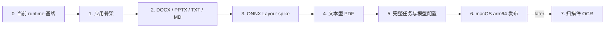

# 迁移路线

> 状态：Active · 原则：每阶段都有可独立验收的产物

## 总体顺序

Layout spike 提前到 PDF 完整迁移之前。否则先把依赖 Paddle 的 PDF pipeline 搬完，再换 ONNX，只会制造一次确定性的返工——这种顺序没有任何值得维护的浪漫。

## Phase 0：固定 behavior oracle

### 工作

- 以已有 JOTO-Translation runtime 与结构回归测试作为 behavior oracle。
- 列出 DOCX、PPTX、TXT、Markdown、PDF pipeline 的入口、依赖、共享工具和企业耦合点，直接迁核心 pipeline，不凭文件名或旧印象重写。
- 盘点现有 pipeline 的提示词、动态插值字段、消息角色和调用位置，固定当前输出行为作为迁移基线。
- 建立每种格式的 golden corpus 与结构指标，不只比较“能不能打开”。
- 在上述 HEAD 重跑对应测试，记录测试命令和结果；不使用旧 commit 的测试数量代替当前证据。
- 明确列出 PageFerry 只允许替换的 provider、job、原子落盘和 module 边界，以及保留的已证实结构 bug fix。

### 验收门

- DOCX、PPTX、TXT 与 Markdown 的关键行为都有当前 runtime 测试或 golden corpus 证据。
- 迁移差异能明确归类为 PageFerry 边界适配、已证实 bug fix 或迁移回归；不能用“重新设计”掩盖漏迁行为。

## Phase 1：应用骨架

### 工作

- 建立 `backend/` Python/FastAPI sidecar、`frontend/` React/Vite/Tailwind UI 和 `tauri/` Tauri 2 壳；三个 runtime 分别维护自己的依赖与锁文件。
- 用 CSS variables 固定 PageFerry 视觉 token，只按需引入可直接维护源码的 shadcn/ui 组件。
- 定义软件专属数据目录并初始化 SQLite。
- 提供健康检查和版本化 model catalog 读取 endpoint。
- 固定 lint、format、test、build 命令与 `AGENTS.md` 约束。
- 安装并锁定 Python、Node、Rust 基础工具链。

### 当前状态

Phase 1 的开发骨架已完成；Python sidecar 冻结与 Tauri 进程管理仍未完成。为验证真实产品路径，DeepSeek 配置、Keychain、任务 API 和结果打开能力已提前随 Phase 2 一起接入。

### 验收门

- 后端测试、lint、format 全过。
- 前端 test、typecheck、lint、format、build 全过。
- Rust `cargo check` 全过，Tauri 配置能解析并生成权限 schema。
- 本地 dev 启动后，UI 能并行读取 health 与 bundled catalog。

## Phase 2：迁移 DOCX、PPTX、TXT 与 Markdown

### 工作

- 先迁 translator contract 与确定性 stub。
- 将原提示词改造成版本化的稳定 system prompt、任务级稳定上下文和变量 segment payload，禁止把原文重新拼回 system instruction。
- 为 prompt 组装增加 snapshot 测试，并在 adapter usage 中归一化 cache read/write token。
- 直接迁入当前 DOCX pipeline；只去除远程存储、企业任务和数据库 entity 依赖，并接入 PageFerry job 与原子落盘。
- 直接迁入当前 PPTX pipeline，并把 speaker notes 作为 PageFerry 必做新增：翻译 shape、text frame、table 与 notes，同时保持 notes relationship。
- 直接迁入当前 TXT 与 Markdown 的读取、分段和回写；Markdown 必须保护代码与链接目标，TXT 必须保留编码和换行风格。
- 为四类轻量格式接入有界 batch fan-out：单 job 默认并发 6，按原 group 顺序写回和推进 progress，不为大文档预建无界 future 队列。
- 在 `backend/modules/` 下分别维护 `plain_text/`、`docx/`、`pptx/`，格式专属 runtime 不互相堆叠。
- 将任务 workspace、输出原子落盘和结构化错误接到统一 module。
- 保留已经用回归测试证实的结构 bug fix；对每次行为差异明确标记是 bug fix、PageFerry 边界适配还是迁移回归。

### 验收门

- golden corpus 能稳定生成并打开。
- 段落/run、表格、页眉页脚和 slide/shape/notes 等关键结构指标达到既定阈值；speaker notes 必须有正文翻译与 relationship 双重检查。
- 不同 segment 的固定 system prefix 字节级一致；受支持 provider 的重复 batch 基准测试能观察到真实 cache usage，未命中时有可解释数据而不是猜测。
- 并发 batch 的完成顺序不改变结构回填、repair/fallback 或 progress 顺序；单 job 上限在 DOCX、PPTX、TXT 与 Markdown 上都有确定性测试。
- 取消、异常和进程中止都不覆盖源文件。

## Phase 3：ONNX Layout spike

### 工作

- 获取并固定可复现的 PP-DocLayoutV2 ONNX artifact。
- 复刻预处理、后处理、label 映射、NMS 与坐标还原。
- 在 macOS arm64 CPU 上比较 Paddle 参考输出和 ONNX 输出。
- 记录冷启动、单页延迟、峰值内存、模型大小与多页批处理策略。

### 验收门

- golden page 的类别和坐标误差有量化报告。
- 无 Paddle、GPU、CUDA 依赖。
- ONNX Runtime wheel 与最终冻结工具兼容。
- 若不通过，给出缩小 PDF 范围或替代模型决策，不进入下一阶段硬凑。

## Phase 4：迁移文本型 PDF

### 工作

- 只接收有文本层的 PDF，扫描页在入口处明确拒绝。
- 迁入文本抽取、阅读顺序、layout、翻译和回写阶段。
- 通过独立 adapter 隔离 `pdfminerex` runtime，不让它渗入普通业务 module。
- 建立字体缺失、坐标溢出、旋转页面和混合语言用例。

### 验收门

- PDF golden corpus 的文本完整性、阅读顺序和可视结构达到阈值。
- 扫描件不会静默输出空文件。
- 不需要 LibreOffice、Office 或 PDF 转换服务才能完成翻译。

## Phase 5：任务流与模型配置

### 工作

- 完成 provider adapter、Keychain、bundled catalog baseline、手动 model inventory、`/models` discovery、首次整组启用、provider 非破坏启停、model 即时启停、显式幂等 sync 与最小 inference probe。
- 为每个已启用 model 提供 reasoning、单 job 并发和应用级共享并发 override；同一 provider + upstream model 跨 job 默认共享 15 个翻译请求槽。
- 增加任务创建、状态、持久化进度、明确的进程中断状态和历史记录 API；当前继续使用 polling，运行中取消仍待实现。
- React 完成供应商启停、模型设置、按 provider 分组的翻译模型选择、新建任务、polling 进度和结果页面。
- 增加打开/定位结果文件的 Tauri command 和最小权限。

### 当前状态

五个 preset、OpenAI-compatible 自定义 provider、Keychain、不落盘的 API Key 行内检测、显式保存与按需 reveal、catalog baseline、首次整组启用、provider/model 独立启停、手动 model、显式 model sync、model runtime settings、任务历史与结果打开路径已接入。翻译模型按 provider 分组，inactive provider 不进入任务入口。当前执行器仍是进程内 `BackgroundTasks`；sidecar 重启会把遗留任务标为 `process_interrupted`，尚未实现运行中取消或 durable worker。

### 验收门

- 新用户只输入 API Key 即可完成一个已支持 provider 的配置。
- 首次验证成功后当次完整 model inventory 默认全部启用；用户可以逐个关闭多余模型，不能关闭最后一个 enabled model。
- provider 暂停不删除 Key、model inventory 或 runtime settings；“移除配置”才执行 destructive cleanup。
- 用户可以手动登记 `/models` 未列出的 model；新记录默认 disabled，只有真实 inference probe 成功后才能启用。
- 重复同步相同 inventory 不制造重复行，不改 enabled/default、probe 或 runtime settings；远端额外 model 消失时只更新 availability。
- 翻译模型选择器按 active provider 分组，不展示 inactive provider、disabled model 或 probe failed model。
- sync 不会因远端未返回而把 manual model 标记 unavailable，来源归属始终遵守 `catalog > manual > remote`。
- 多个 job 使用同一 upstream model 时共同遵守应用级上限；retry backoff 在释放共享 slot 后执行。
- 错误能区分 Key、endpoint、model、rate limit、network 与 pipeline 问题。
- 重启应用后历史可恢复，运行中任务变为明确的中断状态。

## Phase 6：macOS arm64 发布闭环

### 工作

- 冻结 Python sidecar，Tauri 负责启动、健康等待、退出和异常回收。
- 打包模型 manifest、catalog、SQLite migration 和运行资源。
- 完成代码签名、公证、升级和卸载策略。
- 在没有开发工具链的新用户机器做 clean-room smoke test。

### 验收门

- DMG 安装、首次启动、模型配置、五种格式翻译、打开结果、升级和卸载全部通过。
- 运行时不依赖用户预装 Python、Node、Rust、Office 或 LibreOffice。

## Phase 7：扫描件与 OCR（v0.1 之后）

- 选择 ONNX Runtime OCR 方案。
- 覆盖页面 0/90/180/270、行 0/180 和轻微 skew。
- 把扫描 PDF 作为独立能力开关接入，不改变文本型 PDF 已稳定 contract。
- 图像重绘仍单独立项，不默认复活原图像翻译 pipeline。

## 最近下一步

1. 用两份真实 DOCX 与至少一份真实 PPTX 完成 DeepSeek 翻译和 render QA。
2. 对同一 model 启动多个真实 job，验证单 job 6、跨 job 15、rate limit retry 释放 slot，以及原序 progress contract。
3. 固定首批 golden corpus 的结构签名；外部样例只读使用，不提交到仓库。
4. 完成 sidecar 生命周期、随机端口与 boot token 的 Tauri 闭环。
5. 将原生文本型 PDF 保持为独立 Phase 4，不塞回轻量格式 module。
