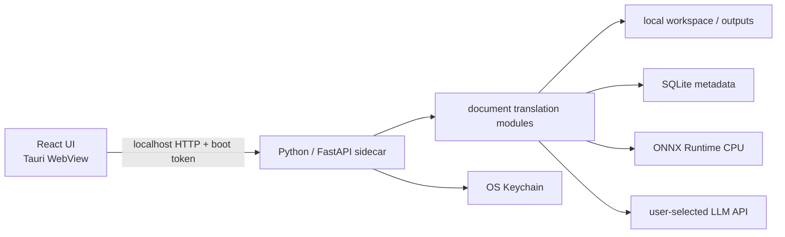

# 技术架构

> 状态：Draft · 当前只完成初始化骨架

## 1. 进程拓扑



开发期固定使用 `127.0.0.1:8765`。发布版由 Tauri 拉起冻结后的 Python sidecar，使用随机可用端口和一次性 boot token；端口和 token 通过受控启动参数传递。CORS 只是浏览器边界，不是本地 API 的身份认证，不能用它代替 token。

当前仓库尚未实现 sidecar 冻结与启动管理。开发时 `make backend` 单独启动 uvicorn，`make dev` 由 Tauri 按配置启动 Vite；这个两终端流程刻意暴露真实进程边界，等 Rust 完成 sidecar 生命周期管理后再合并成单命令。

## 2. 仓库结构

```text
frontend/
  package.json             # 管理 React/Vite/Tailwind、shadcn/ui 依赖与 Tauri Node CLI
  src/
    App.tsx                # 当前单页面入口，功能增长后再拆 feature
    components/ui/         # 按需生成并由本仓库维护的 shadcn/ui 组件
    lib/                   # 本地 API client
    styles/                # Tailwind 入口、PageFerry token 与全局样式
  tests/                   # React 单元与交互测试
backend/
  pyproject.toml           # Python 依赖与工具配置
  main.py                  # FastAPI 组装与 lifespan
  core/                    # settings、paths、version、logging、errors
  api/                     # HTTP schema 与流程编排
  modules/
    document_translation/  # 跨格式 contract 与任务流程
    model_catalog/         # provider/model catalog 及其服务适配
  db/                      # SQLite schema、migration 与持久化实现
  resources/               # 随应用发布的版本化资源
  tests/
tauri/                     # Rust crate、Tauri 权限与打包配置
  Cargo.toml
  rust-toolchain.toml
  binaries/               # 生成的 target-specific Python sidecar（Git 忽略）
scripts/                   # 仅放跨 runtime 的构建与发布脚本
.data/                     # 仅开发期使用的 runtime 数据
docs/dev/                  # 当前计划与决策
```

顶层结构参考 [`tauri-fastapi-full-stack-template`](https://github.com/fudanglp/tauri-fastapi-full-stack-template/tree/c31457a52d4a7f1faf678157fde8b95f353cc75e)：用 `frontend/`、`backend/` 和 `tauri/` 把三种 runtime 的依赖、锁文件和构建产物隔开。这里只采用这个职责边界，不照搬模板中的认证、SQLModel/Alembic、Unix socket、托盘、前端组件栈或代码生成。

`backend/` 内部不再套 `pageferry/` 或 `app/` 包目录，因为它当前就是一个可执行 sidecar，不是待发布的通用 Python library。uv 使用 non-package 模式，直接运行 `backend/main.py` 中的 `main:app`。根目录只承担跨 runtime 协调，不存放 Node、Python 或 Rust 依赖清单。

前端使用 Tailwind CSS v4 的 Vite plugin，不维护空壳 `tailwind.config.js`。颜色、圆角和语义状态统一映射到 PageFerry 的 CSS variables；shadcn/ui 只作为可复制、可修改的组件源码来源，不作为整套视觉模板。组件从具体文件直接 import，避免额外 registry 或聚合导出进入桌面包。

## 3. 后端依赖方向

```text
api -> modules -> db
  |       |------> core
  |--------------> core
```

- `api`：验证 HTTP 输入、选择状态码、序列化输出；不直接写 SQLite 或调用第三方 SDK。
- `modules`：按功能纵向组织任务状态机、pipeline，以及该功能专属的文件系统、LLM、ONNX Runtime 或 Keychain 实现。
- `db`：只承载 SQLite schema、migration、连接和持久化代码，不演变成新的通用杂物层。
- `core`：只放全局底座，不放格式翻译规则。

每种文档只实现自己的 pipeline adapter，不复制一整套 DDD entity/repository/service/controller。当前规模不设置通用 `infra/`：业务实现跟着 module 走，SQLite 明确收口到 `db/`；只有第二个真实 module 需要复用其他实现时，才提取名称明确的共享组件。需要隔离的是变化边界，不是目录层数。

## 4. Pipeline 迁移原则

从 `/Users/atopoz/JOTO-Code/JOTO-Translation` 迁移时遵循：

1. 先用 golden corpus 固定原行为、输入输出和结构指标。
2. 原样迁入 DOCX、PPTX、PDF 核心逻辑，剔除企业任务、租户和远程存储依赖。
3. 每次只替换一个 runtime 或外部 adapter，不同时重写算法和模型。
4. 先跑 translator stub 的确定性测试，再接真实模型 endpoint。
5. 原项目私有 fork（例如 `pdfminerex`）独立放入 vendor 区，带来源、修改说明和许可证。

统一 contract 当前保持很小：

```python
class DocumentPipeline(Protocol):
    document_kind: Literal["docx", "pptx", "pdf"]

    def translate(self, request: TranslationRequest) -> TranslationResult: ...
```

等实际迁移暴露共同需求后再增加进度、取消和 checkpoint contract，不提前制造万能抽象。

### Prompt 组装与缓存

迁移原 pipeline 时必须同时改造提示词组装，不能继续把系统规则、任务参数和待翻译文本拼成一个不断变化的大字符串。统一请求按以下顺序构造：

```text
[全局稳定前缀] 固定 system prompt、输出 contract、格式保护规则、版本号
       +
[任务稳定上下文] 源/目标语言、术语表、风格选项等同一任务内不变的参数
       +
[请求变量区]     当前待翻译 segment id 与原文
```

- 固定 system prompt 使用显式模板版本管理；不得插入文件名、任务 ID、segment 内容、时间戳或随机值。
- 待翻译文本只作为结构化数据进入变量区，不与 instruction 做字符串拼接。这同时减少源文档内容改变指令语义的机会。
- 任务参数使用确定性序列化：字段顺序、空白、术语排序和 tool/schema 顺序必须稳定。重试同一 batch 时生成完全一致的前缀。
- provider adapter 负责适配自动缓存或显式 cache control 的协议差异；不支持 prompt caching 时保持相同翻译语义，只是没有缓存收益。
- 统一归一化记录 input、output、cache read、cache write token；没有 provider usage 证据时不能声称“缓存已命中”。日志只记录计数、模板版本和 hash，不记录正文。
- 分离消息只是必要条件，不保证命中。还要满足 provider 的前缀匹配、最小长度和有效期规则，因此需要用真实 endpoint 做重复 batch 基准测试。

Prompt snapshot 测试至少覆盖：只改变 segment 时固定 system 不变；相同任务上下文序列化稳定；模板升级会改变明确版本；DOCX、PPTX、PDF 最终使用同一套 translator prompt contract。

## 5. 格式边界

### DOCX

优先保持段落、run、表格、页眉页脚、脚注/尾注、批注关系和样式引用。输出必须是新的 `.docx`；任何异常不回写原包。

### PPTX

优先保持 slide、shape、text frame、paragraph、run、group 和 speaker notes 的关系。长译文溢出先记录可检测指标，不在首轮迁移中偷偷引入自动缩放算法。

### PDF

v0.1 只接受有可提取文本层的 PDF。文本抽取、阅读顺序、布局分析、翻译和回写拆成可测试阶段。扫描件与图片型页面要返回明确的 `unsupported_scanned_pdf`，不能静默产出空结果。

图像翻译 pipeline 整体移出首版。未来基于生图模型的方案单独立项，不与文档文字 pipeline 共用含糊 contract。

## 6. Layout 与 OCR

- 不引入 Paddle runtime、GPU 或 CUDA。
- Layout 保留 PP-DocLayoutV2 模型家族可用的 label/输出 contract，先完成导出模型在 ONNX Runtime CPU 上的等价性 spike。
- spike 必须比较输入预处理、输出 tensor、NMS、label 映射、坐标还原、速度、内存与平台 wheel 可用性；不能只证明“模型能跑”。
- OCR 属于扫描件里程碑，候选方案必须是 ONNX Runtime 路径，并有 0/90/180/270 页面方向、0/180 行方向和轻微 skew 测试。
- 模型包独立版本化并校验 checksum，不把数百 MB 权重直接塞进 Git。

为了避免 PDF 迁移后返工，Layout ONNX spike 放在 PDF 完整迁移之前；若 spike 不通过，先收窄 PDF 能力，不把 Paddle 偷偷带回客户端。

## 7. SQLite 与文件系统

SQLite 只负责轻量 metadata：

- `translation_jobs`：输入路径引用、输出路径、格式、状态、进度、provider/model、错误码和时间戳。
- 后续增加 provider settings 时，只保存非敏感配置和 Keychain reference。
- 启用 WAL、foreign keys、busy timeout；写入保持短事务。
- schema migration 使用单向、可测试的版本脚本，禁止应用启动时凭 ORM 自动猜结构。

文档数据走文件系统，不以 BLOB 写入 SQLite。任务目录使用 UUID，内部临时文件不可由原始文件名直接拼路径，防止目录穿越和重名覆盖。

开发期通过 `PAGEFERRY_DATA_DIR` 把运行数据定向到仓库 `.data/`，便于清理和观察；生产版不写源码或安装目录，而使用操作系统分配给 PageFerry 的 app-data 目录。所谓“软件所属目录”应理解为这个专属用户数据目录，不是只读的 `.app` bundle、`Program Files` 或源码目录。

## 8. 本地 API

当前骨架：

| Endpoint                    | 用途                     |
| --------------------------- | ------------------------ |
| `GET /healthz`              | sidecar 存活与版本       |
| `GET /api/v1/health`        | v1 健康检查              |
| `GET /api/v1/model-catalog` | 读取随应用发布的 catalog |

后续按能力增加 `/jobs`、`/providers` 和事件流。错误返回稳定 `code`，日志保留内部异常但不把路径、Key 或文档正文泄漏给 UI。

进度优先采用单向 SSE；取消走普通命令 endpoint。首版不需要 WebSocket 的双向复杂度。

## 9. Tauri 与打包

目标发布链参考 [Tauri v2 Python sidecar 示例](https://github.com/dieharders/example-tauri-v2-python-server-sidecar/tree/40ff11b0746a80cf8b3b3cb5a8f8c7842ca6c1e1)，但只借用其 sidecar 打包与生命周期思路，不沿用其根目录依赖混装、固定端口、宽泛 CORS/CSP 和单文件后端结构。Tauri 的 `externalBin` 与 target triple 命名以[官方文档](https://v2.tauri.app/develop/sidecar/)为准。

目标发布链：

1. uv 锁定 Python 依赖。
2. 用 PyInstaller 或 Nuitka 冻结 sidecar；工具与 onefile/onedir 形式要经过启动速度、动态库、ONNX 模型路径和退出回收 spike 后再定。
3. 产物命名为 `tauri/binaries/pageferry-backend-$TARGET_TRIPLE`，例如 `pageferry-backend-aarch64-apple-darwin`；Windows 追加 `.exe`。
4. Tauri `externalBin` 只声明逻辑路径 `binaries/pageferry-backend`，并收入必要资源。
5. Rust 持有唯一 child handle，解析 stdout 的 JSON ready handshake，向 UI 提供实际端口；退出时先请求优雅关闭，再回收进程。
6. 首次启动创建用户数据目录，模型按 manifest 下载或随安装包分层提供。
7. 完成签名、公证、升级和卸载残留策略。

`tauri/binaries/` 只跟踪 `.gitkeep`，禁止提交本机编译产物。CI 必须在目标操作系统上先构建匹配 target triple 的 sidecar，再执行 Tauri build；不能拿一个平台的 Python 可执行文件跨平台复用。

优先发布 macOS arm64，再做 Windows x64；不要在核心 pipeline 尚未固定时同时调试三平台打包。

## 10. 来源与许可证

- PageFerry 本仓库为 Apache-2.0。
- JOTO-Translation 当前源码为 MIT；复制代码时保留原版权头，并维护 `THIRD_PARTY_NOTICES` 和迁移来源清单。
- Cherry Studio 为 AGPL 参考项目：只学习 provider registry 与 runtime merge 思路，不复制其代码、catalog 数据或图标。
- 每个 ONNX 模型单独核对模型权重、训练数据和再分发许可证，不能把“代码可用”误当成“模型可商用分发”。
