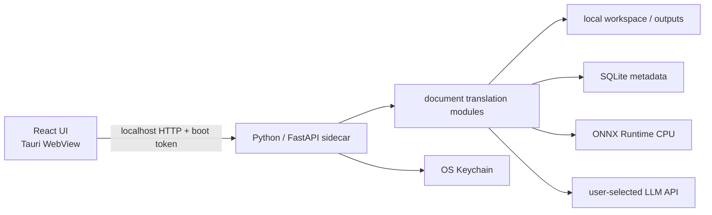

# 技术架构

> 状态：Active · 轻量格式 pipeline 与桌面端三页信息架构正在收口

## 1. 进程拓扑



开发期固定使用 `127.0.0.1:8765`。发布版由 Tauri 拉起冻结后的 Python sidecar，使用随机可用端口和一次性 boot token；端口和 token 通过受控启动参数传递。CORS 只是浏览器边界，不是本地 API 的身份认证，不能用它代替 token。

当前仓库已实现本地 API、provider 配置、任务 metadata 和四类轻量格式 runtime，但尚未实现 sidecar 冻结与启动管理。开发时 `make backend` 单独启动 uvicorn，`make dev` 由 Tauri 启动 Vite；等 Rust 完成 sidecar 生命周期管理后再合并成单命令。

## 2. 仓库结构

```text
frontend/
  package.json             # 管理 React/Vite/Tailwind、shadcn/ui 依赖与 Tauri Node CLI
  src/
    App.tsx                # 应用壳与三页导航状态
    components/ui/         # 按需生成并由本仓库维护的 shadcn/ui 组件
    features/
      navigation/          # compact 应用侧栏
      translation/         # 文件翻译页
      history/             # 独立历史记录页
      providers/           # provider 二栏配置页
      jobs/                # 两个任务页面复用的 job 行组件
    lib/                   # 本地 API client
    styles/                # Tailwind 入口、PageFerry token 与全局样式
  tests/                   # React 单元与交互测试
backend/
  pyproject.toml           # Python 依赖与工具配置
  main.py                  # FastAPI 组装与 lifespan
  core/                    # settings、paths、version、logging、errors
  api/                     # HTTP schema 与流程编排
  modules/
    translation/           # 跨格式 contract、prompt 与任务编排
    docx/                  # DOCX runtime
    pptx/                  # PPTX runtime，包含 speaker notes
    plain_text/            # TXT 与 Markdown runtime
    model_catalog/         # provider/model catalog 及其服务适配
  db/                      # SQLite schema、migration 与持久化实现
  resources/               # 随应用发布的版本化资源
  tests/
tauri/                     # Rust crate、Tauri 权限与打包配置
  Cargo.toml
  rust-toolchain.toml
  binaries/               # 生成的 target-specific Python sidecar（Git 忽略）
scripts/                   # 仅放跨 runtime 的构建与发布脚本
.data/                     # 仅开发期使用的 runtime 数据
docs/dev/                  # 当前计划与决策
```

顶层结构参考 [`tauri-fastapi-full-stack-template`](https://github.com/fudanglp/tauri-fastapi-full-stack-template/tree/c31457a52d4a7f1faf678157fde8b95f353cc75e)：用 `frontend/`、`backend/` 和 `tauri/` 把三种 runtime 的依赖、锁文件和构建产物隔开。这里只采用这个职责边界，不照搬模板中的认证、SQLModel/Alembic、Unix socket、托盘、前端组件栈或代码生成。

`backend/` 内部不再套 `pageferry/` 或 `app/` 包目录，因为它当前就是一个可执行 sidecar，不是待发布的通用 Python library。uv 使用 non-package 模式，直接运行 `backend/main.py` 中的 `main:app`。根目录只承担跨 runtime 协调，不存放 Node、Python 或 Rust 依赖清单。

前端使用 Tailwind CSS v4 的 Vite plugin，不维护空壳 `tailwind.config.js`。颜色、圆角和语义状态统一映射到 PageFerry 的 CSS variables；shadcn/ui 只作为可复制、可修改的组件源码来源，不作为整套视觉模板。组件从具体文件直接 import，避免额外 registry 或聚合导出进入桌面包。

### 桌面壳与前端信息架构

macOS 主窗口保留系统原生装饰，使用 Tauri `Overlay` titlebar 隐藏窗口标题并保留原生 traffic lights。Windows 通过平台配置关闭 decorations，由 React 自绘最小化、最大化/还原和关闭 controls，并用 Windows 专用 capability 只开放这三个窗口命令。两端共用横跨窗口的 topbar 作为 drag region，sidebar 从 topbar 下方开始，不占用系统窗口按钮区域；Linux 保留原生 titlebar，不重复渲染应用 topbar。应用侧栏使用 compact 行高、克制的 active fill 与短标签，主导航只承担三个独立工作页面的切换：文件翻译、历史记录、模型服务；模型服务与前两个任务页面之间用轻分割线区分工作流边界。应用级设置固定为侧栏最底部的独立入口，不混入模型服务页，也不在品牌区堆放大段说明。sidecar 正常连接时不常驻展示状态或版本；连接中与离线状态才临时显示在设置上方。

#### 文件翻译页

- 顶部只放紧凑的源语言、目标语言与已启用模型选择；model picker 不展示未配置、未启用或 probe 失败的模型。翻译语种 selector 的主名称跟随当前 UI locale，本族语名称只在展开列表中作为次级识别信息，选中后的 trigger 仍只显示主名称。
- 选中文件后，上传区收敛为文件卡。文件卡下方直接铺开紧凑的「文件选项」，不再用 disclosure 隐藏入口；只渲染当前 `document_kind` 已真实支持的开关：DOCX 为翻译表格，PPTX 为翻译表格与 speaker notes，默认均开启；TXT、Markdown 当前没有选项时不展示空面板。
- 文件类型变化或移除文件时重置为对应 module 默认值。创建任务时发送补齐默认值后的 options snapshot，任务开始后不再受 UI 默认值变化影响。
- 页面任务区只显示当前 renderer session 创建的 job id。任务 polling 可以读取后端任务列表，但渲染前必须用 session id 集合过滤，不能把持久化历史填进文件翻译页。renderer 重启后的旧任务只在历史记录页出现。

#### 历史记录页

历史记录页独占 `GET /api/v1/jobs` 返回的持久化任务列表，展示文件名、语言、provider/model、状态、时间与结果操作。options snapshot 由后端保存并随任务 contract 返回，供后续详情视图复现；列表不把全部选项摊开成说明文字。历史页也不复制上传区、语言选择或 provider 配置表单。

#### 通用设置与 i18n

设置页承载影响整个 renderer 的设备级偏好，首个设置为应用语言，并在独立「关于」区展示构建期应用版本。版本来自 renderer package metadata，不借用 sidecar 在线状态，因此服务离线时仍可确认当前客户端版本。首版完整支持简体中文与 English，并提供「跟随系统」；解析 `navigator.languages` 时按用户声明的优先顺序选择第一个受支持 locale，未匹配时 fallback 到 English。显式选择写入版本化 `localStorage` key，跟随系统不写冗余值；切换只更新 React context 与文档 `lang`，不得 remount 主窗口、清空翻译文件或 provider 草稿。

`uiLocale` 与任务的 `source_language` / `target_language` 是两套独立 contract。翻译语种继续提交稳定 BCP 47 code；所有工作页、状态、校验提示和 ARIA 文案从同一应用级 message catalog 读取，历史页与翻译页不得各自维护另一份语言名称映射。

#### 模型供应商页

模型供应商页在主内容区使用二栏布局，不使用抽屉：左栏固定陈列 DeepSeek、Kimi、Zhipu GLM、MiniMax、Xiaomi MiMo 五个 preset，并把用户创建的 OpenAI-compatible provider 放入独立分组；右栏是当前 provider 的连接配置与 model inventory。侧栏不展示 active provider 数量，左栏标题也不复述供应商总数或启用数；状态直接由当前列表项表达。preset 不再经过“先添加再配置”的中间状态，未配置项也始终可选。

右栏按连接与模型两个紧凑 section 排列：每个 provider 只有一个 API Key；字段旁的「检测」只对当前草稿做一次不落盘的最小 inference，底部「保存配置」才表达持久化意图，并在完整验证成功后原子写入 Keychain 与 metadata。首次保存成功默认进入 active，之后可用标题栏开关非破坏暂停；模型区以 bundled catalog 作为稳定 baseline，提供手动添加、「同步模型」、enabled 开关和唯一 default 选择。手动添加只登记 `source: "manual"` 的 disabled model，之后通过模型开关完成最小 inference 才能启用；首次配置前添加的 manual model 则随 `enable_all_models` 整组验证。同步对已配置且提供可靠 `models_path` 的 provider 开放，即使 provider 暂时 inactive 也使用已保存 Key 幂等增补 remote model 并更新 availability，不改 manual model 的 availability，也不改 enabled/default、probe 或 runtime settings。每个已启用 model 可以覆盖 catalog 支持的 reasoning policy，以及单 job 和应用级共享两层并发；省略 override 时使用应用默认的 6 与 15。

内置 preset 显示当前 effective Base URL，默认值由 catalog 托管，override 放入高级设置而不是普通主表单；字段省略表示保留 override，`null` 或空白表示恢复 catalog 默认值。自定义 provider 创建时输入显示名与 Base URL，首版换地址只能删除后重建，不向 UI 宣称可编辑。discovery 只合并并预览 catalog baseline、manual inventory 与 remote extras，不持久化当次凭据或远端候选；保存时才提交 enabled/default inventory 并执行最小 inference。即使 `/models` 失败，已持久化的 manual model 也可以继续进入 inference probe，但不能跳过 probe 直接启用。

五个内置 provider 必须使用可辨认的彩色品牌 icon，provider 列表、详情标题与模型行保持同一套视觉映射，不得再用星形字符占位。只有未来无法识别的自定义 provider 才允许使用中性通用图标。

文件选择器、拖放校验和 job API 当前只接受 DOCX、PPTX、TXT、Markdown。前端不得展示 PDF 或 XLSX 支持，直到对应 pipeline、任务执行和结果打开完成端到端验收。

## 3. 后端依赖方向

```text
api -> modules -> db
  |       |------> core
  |--------------> core
```

- `api`：验证 HTTP 输入、选择状态码、序列化输出；不直接写 SQLite 或调用 provider SDK。
- `modules`：按功能纵向组织任务状态机、pipeline，以及该功能专属的文件系统、LLM、ONNX Runtime 或 Keychain 实现。
- `db`：只承载 SQLite schema、migration、连接和持久化代码，不演变成新的通用杂物层。
- `core`：只放全局底座，不放格式翻译规则。

每种文档只实现自己的 pipeline adapter，不复制一整套 DDD entity/repository/service/controller。当前规模不设置通用 `infra/`：业务实现跟着 module 走，SQLite 明确收口到 `db/`；只有第二个真实 module 需要复用其他实现时，才提取名称明确的共享组件。需要隔离的是变化边界，不是目录层数。

## 4. Pipeline 行为原则

1. DOCX、PPTX、TXT、Markdown 的抽取、分段、批处理与回填行为必须由结构回归测试固定；PDF 在首版后续阶段保持独立接入。
2. provider、job、原子落盘与 module 接口保持桌面端边界，不引入企业任务、租户、远程存储或 Celery runtime。
3. 在 `backend/modules/` 下保持 `plain_text/`、`docx/`、`pptx/` 三个独立目录；格式专属规则不挤进共享 `translation/` module。
4. 非直观结构必须有针对性测试。例如 DOCX 同一 run 内同时存在 `w:tab` 与 `w:t` 时，要翻译文字并保留 tab 的原始位置，不能因为结构标记而漏译整段文字。
5. PPTX speaker notes 必须保持 slide↔notes relationship，并单独验证 notes 正文确实完成翻译。
6. 先跑 translator stub 的确定性测试，再接真实模型 endpoint；模型接入不能替代结构回归测试。
7. 同一 job 的 batch 允许有界并发，但结构写回与 progress 必须按原 group 顺序提交；不能让网络返回顺序改变文档行为。

统一 contract 当前保持很小：

```python
class DocumentPipeline(Protocol):
    document_kind: Literal["docx", "pptx", "txt", "md"]

    def translate(
        self,
        request: TranslationRequest,
        *,
        report_progress: TranslationProgressReporter | None = None,
    ) -> TranslationResult: ...
```

当前共享边界只增加了阶段进度 reporter；取消和 checkpoint 等 contract 继续等真实需求出现后再引入，不提前制造万能抽象。

### Prompt 组装与缓存

提示词组装不能把系统规则、任务参数和待翻译文本拼成一个不断变化的大字符串。统一请求按以下顺序构造：

```text
[全局稳定前缀] 固定 system prompt、输出 contract、格式保护规则、版本号
       +
[任务稳定上下文] 源/目标语言、术语表、风格选项等同一任务内不变的参数
       +
[请求变量区]     当前待翻译 segment id 与原文
```

- 固定 system prompt 使用显式模板版本管理；不得插入文件名、任务 ID、segment 内容、时间戳或随机值。
- 待翻译文本只作为结构化数据进入变量区，不与 instruction 做字符串拼接。这同时减少源文档内容改变指令语义的机会。
- 任务参数使用确定性序列化：字段顺序、空白、术语排序和 tool/schema 顺序必须稳定。重试同一 batch 时生成完全一致的前缀。
- provider adapter 负责适配自动缓存或显式 cache control 的协议差异；不支持 prompt caching 时保持相同翻译语义，只是没有缓存收益。
- 统一归一化记录 input、output、cache read、cache write token；没有 provider usage 证据时不能声称“缓存已命中”。日志只记录计数、模板版本和 hash，不记录正文。
- 分离消息只是必要条件，不保证命中。还要满足 provider 的前缀匹配、最小长度和有效期规则，因此需要用真实 endpoint 做重复 batch 基准测试。

Prompt snapshot 测试至少覆盖：只改变 segment 时固定 system 不变；相同任务上下文序列化稳定；模板升级会改变明确版本；DOCX、PPTX、TXT、Markdown 最终使用同一套 translator prompt contract。

### Batch 并发与上游保护

翻译吞吐由两层上限共同约束：

- 单 job 默认最多并发 6 个 batch。DOCX、PPTX、TXT 与 Markdown 共用有界滑动窗口，运行中与已提交但未完成的 future 总数不超过有效单 job 上限，不为大文档一次性创建无界队列。
- 同一 `provider_id + upstream_model_id` 在整个 sidecar 生命周期内默认最多同时发出 15 个翻译 batch。这个 limiter 是 app-scoped，所有 job 共享；不同 provider 或 upstream model 使用独立预算。
- 每个已启用 model 可以覆盖两层上限，当前有效单 job 上限不能超过有效共享上限。收紧共享上限时不取消已经在途的请求，它们自然结束；新请求等待新容量。

worker 内先完成该 group 的 provider 调用、repair 与 fallback，主线程只按输入顺序提交连续收敛的结果前缀并推进 progress。后面的 group 即使先返回，也要等前序 group 收敛后再写回，因此并发只改变等待时间，不改变结构回填、fallback 或可观察进度顺序。

全局 slot 只包住一次实际翻译请求。遇到可重试的 rate limit 或暂时上游错误时，adapter 必须先退出 slot，再执行 backoff；下一次尝试重新竞争容量，不能占着共享预算睡眠。prompt cache 不单独建立串行预热或互斥，它继续依赖稳定前缀提高自然命中率。

provider 的 Base URL、Keychain secret、model row 与 limiter 配置必须按同一 app-scoped state snapshot 读取。reconfigure 的网络 probe 不持锁，Keychain 与 SQLite 提交则处于同一短临界区，并用 probe 前的 provider record、secret、已选 model rows 与 manual inventory 做 CAS；remote sync 同样在网络返回后做 CAS，配置或 manual inventory 已变化时丢弃旧结果并要求重试，绝不拼接旧 URL 与新 Key，也不让迟到的 probe 覆盖新加 model 或让变化后的 reasoning/concurrency settings 未经验证就进入 runtime。

## 5. 格式边界

### DOCX

优先保持段落、run、表格、页眉页脚、脚注/尾注、批注关系和样式引用。输出必须是新的 `.docx`；任何异常不回写原包。

### Office 字体

DOCX 与 PPTX 共用以下字体管理 contract：先根据 `target_language` 和实际译文识别目标 script，再读取 run 对应的 Office 字体 slot。已知原字体能够覆盖目标 script 时保持 run 的字体声明不变；只有原字体明确不兼容或无法识别时，才写入该语种的固定 preset。字体名与 preset 不相同本身不能作为替换理由，例如宋体翻译为简体中文时仍应保留宋体。

兼容性判断使用随应用发布的确定性字体 catalog，不根据当前开发机临时安装了什么字体改变结果。fallback 只修改 OOXML 中的字体名称与对应 script slot；pipeline 不新增、下载或嵌入字体文件，也不删除源文件已有的字体资源。最终字体查找、替代和已有嵌入字体的使用交给 Word/PowerPoint。字体决策必须覆盖 DOCX 正文、表格、页眉页脚、脚注/尾注，以及 PPTX shape、table 和 speaker notes。

不得只判断原字体名是否等于 preset；这种做法会把能够正常渲染目标 script 的字体替换掉，并改变 glyph metrics、行距或分页。字体 catalog 是稳定、保守的兼容性判断，不等同于读取字体文件后逐 glyph 检测；无法确认的字体按不兼容处理。

### PPTX

翻译 slide、shape、text frame、paragraph、run、group、table 和 speaker notes 中的正文，并保持 slide↔notes relationship。采用保守字体缩小：只缩不放、不得小于 8pt、最多缩小到原字号的 75%；它不是自动重排或高保真预览。

speaker notes 不是单独追加的附属 pipeline。无论当前任务是否启用 notes 翻译，其抽取、翻译、回填和 relationship 都必须使用与 slide 正文相同的结构验收边界；高级选项默认开启 notes 翻译。

### TXT 与 Markdown

TXT 与 Markdown 共用 `plain_text` module，但保留独立 adapter。TXT 需要检测并保留 UTF 编码、换行风格与末尾换行；Markdown 在分段前保护 fenced code、inline code、HTML、链接目标和其他不可翻译 span，翻译后再按原位置恢复。纯文本仍按 segment 批量送入统一 translator contract，不能把整文件正文拼进 system instruction。

### PDF

PDF 尚未进入当前可用格式。首版后续阶段接入原生文本型 PDF 时，文本抽取、阅读顺序、布局分析、翻译和回写必须拆成可测试阶段；在端到端验收通过前，不接入文件选择器或 job API。

图像翻译 pipeline 整体移出首版。未来基于生图模型的方案单独立项，不与文档文字 pipeline 共用含糊 contract。

## 6. Layout 与 OCR

- 不引入 Paddle runtime、GPU 或 CUDA。
- Layout 保留 PP-DocLayoutV2 模型家族可用的 label/输出 contract，先完成导出模型在 ONNX Runtime CPU 上的等价性 spike。
- spike 必须比较输入预处理、输出 tensor、NMS、label 映射、坐标还原、速度、内存与平台 wheel 可用性；不能只证明“模型能跑”。
- OCR 属于扫描件里程碑，候选方案必须是 ONNX Runtime 路径，并有 0/90/180/270 页面方向、0/180 行方向和轻微 skew 测试。
- 模型包独立版本化并校验 checksum，不把数百 MB 权重直接塞进 Git。

为了避免 PDF 接入后返工，Layout ONNX spike 放在 PDF 完整实现之前；若 spike 不通过，先收窄 PDF 能力，不把 Paddle 偷偷带回客户端。

## 7. SQLite 与文件系统

SQLite 只负责轻量 metadata：

- `translation_jobs`：输入路径引用、输出路径、格式、状态、三阶段 `progress_stage`、真实 `processed_segments/total_segments`、provider/model、源/目标语言、错误码、时间戳和创建时解析完成的 `options_json` snapshot。
- `options_json` 按 `kind` 区分格式并保存补齐默认值后的不可变配置；当前 DOCX 保存 `translate_tables`，PPTX 保存 `translate_tables` 与 `translate_notes`。历史记录必须读取该 snapshot，不能用未来版本的新默认值反推旧任务。
- `provider_configs` 只保存非敏感连接 metadata、非破坏启停字段 `active`、`secret_ref`、`default_model_id`、最近一次 probe 的 effective Base URL snapshot、可空的 `base_url_override` 与 `last_synced_at`，并用唯一 `provider_id` 固化“一个 provider 只有一份配置”；override 为空表示跟随 catalog 默认值。`provider_model_configs` 保存取值为 `catalog`、`manual` 或 `remote` 的 model 来源、enabled/available、probe 状态，以及可空的 reasoning、单 job 并发和共享并发 override；`NULL` 表示跟随 catalog 或应用默认值。同一 upstream identity 的来源优先级为 `catalog > manual > remote`，sync 只根据远端缺失改变 remote model 的 availability。`custom_provider_definitions` 保存用户定义的显示名与 Base URL。API Key 只写系统 Keychain。
- 旧库若存在同一 provider 的重复配置，执行唯一约束前先把候选 `secret_ref` 写入 reconciliation staging；startup 保留实际可用的最高优先级 reference，并幂等清理其余 Keychain 条目。staging 只保存 opaque reference，不保存 Key，临时 Keychain 故障不会阻止 sidecar 启动。
- 启用 WAL、foreign keys、busy timeout；写入保持短事务。
- schema migration 使用单向、可测试且带 checksum 的版本脚本；已经写入开发或用户数据库的 migration 不再原地修改，后续 schema 调整必须新增版本，禁止应用启动时凭 ORM 自动猜结构。

文档数据走文件系统，不以 BLOB 写入 SQLite。任务目录使用 UUID，内部临时文件不可由原始文件名直接拼路径，防止目录穿越和重名覆盖。

开发期通过 `PAGEFERRY_DATA_DIR` 把运行数据定向到仓库 `.data/`，便于清理和观察；生产版不写源码或安装目录，而使用操作系统分配给 PageFerry 的 app-data 目录。所谓“软件所属目录”应理解为这个专属用户数据目录，不是只读的 `.app` bundle、`Program Files` 或源码目录。

renderer 不直接获得任意本机路径的打开权限。点击任务结果时，前端只调用 Tauri `open_output` command；Rust 先 canonicalize 路径，确认目标是普通文件且位于允许的 `outputs/` 根目录内，再交给系统默认应用。debug 构建额外允许仓库 `.data/outputs`，用于配合 `make backend`；release 构建只允许系统 data 与 local-data 下的 `PageFerry/outputs`，不放行源码目录。

## 8. 本地 API

当前 endpoint：

| Endpoint                                                | 用途                                                                                                 |
| ------------------------------------------------------- | ---------------------------------------------------------------------------------------------------- |
| `GET /healthz`                                          | sidecar 存活与版本                                                                                   |
| `GET /api/v1/health`                                    | v1 健康检查                                                                                          |
| `GET /api/v1/model-catalog`                             | 读取随应用发布的 catalog                                                                             |
| `GET /api/v1/providers`                                 | 读取不含 secret 的 provider、active、effective Base URL、override 与 enabled/default model inventory |
| `GET /api/v1/providers/{id}/api-key`                    | 按需读取当前 provider 的 Keychain 明文；要求 boot token，响应禁止缓存                                |
| `POST /api/v1/providers/custom`                         | 创建带 backend 稳定 id 的 OpenAI-compatible 自定义 provider 定义                                     |
| `POST /api/v1/providers/{id}/models`                    | 手动登记一个 disabled model；首次整组或后续单模型 inference 成功后才能启用                           |
| `POST /api/v1/providers/{id}/models/discover`           | 使用临时或既有 Key 及可选 draft Base URL 获取 models；不持久化当次 Key 或 URL                        |
| `POST /api/v1/providers/{id}/probe`                     | 自动选择当次 default/首个候选做临时 inference；不写 Keychain、SQLite 或 active 状态                  |
| `POST /api/v1/providers/{id}/models/sync`               | 使用已保存 Key 幂等 merge catalog baseline 与 remote extras，并更新 availability                     |
| `PUT /api/v1/providers/{id}/active`                     | 非破坏启停 provider；不删除 Key、inventory 或 runtime settings                                       |
| `PUT /api/v1/providers/{id}/models/{model_id}/enabled`  | 即时启停 model；启用先做 inference probe，禁用时保持至少一个 enabled model                           |
| `PUT /api/v1/providers/{id}/models/{model_id}/settings` | 更新已启用 model 的 reasoning 与两层并发 override；显式 `null` 恢复默认                              |
| `PUT /api/v1/providers/{id}`                            | 首次整组启用或重新验证；probe 后保存 metadata、inventory、Base URL override 与 Keychain secret       |
| `DELETE /api/v1/providers/{id}`                         | 移除配置；custom 还会删除其定义，两者都清理 inventory 与 Keychain secret                             |
| `GET /api/v1/jobs`                                      | 历史记录页读取持久化任务                                                                             |
| `GET /api/v1/jobs/{job_id}`                             | 文件翻译页按 session job id 读取最新状态                                                             |
| `POST /api/v1/jobs`                                     | 从 Tauri 本地路径创建任务并冻结 options snapshot                                                     |
| `POST /api/v1/jobs/upload`                              | Web 开发模式上传、创建任务并冻结 options snapshot                                                    |

model discovery 只产生候选列表：先返回 `source: "catalog"` 的 bundled baseline，保留已经持久化的 `source: "manual"` model，有可靠 `models_path` 时再合并账号额外返回的 `source: "remote"` model；它不写 Keychain 或 SQLite。手动添加 endpoint 只持久化 model identity，新记录固定 disabled，不读取 Key 或发网络请求。request 可临时携带 frontend 尚未保存的 preset Base URL，省略时继续使用已存 override，`null` 或空白只在本次恢复 catalog 默认值。已保存的 override 会同时驱动后续 discovery、sync、probe 与 translator。API Key 行的「检测」调用独立 probe endpoint，并携带当前尚未保存的 Key、Base URL 与可选 default model；backend 在没有显式 model id 时自动选择既有 default、catalog 推荐项或第一个候选，只返回本次 model 与 latency，不更新任何本地配置。底部「保存配置」才调用 provider `PUT`：首次显式携带 `enable_all_models: true`，并对完整合并 inventory 执行最小 inference 后全部启用。`/models` 失败时 catalog/manual 候选仍可走 inference probe；检测或保存失败均保留上一次可用配置。

明文 Key 不进入 provider 列表或通用状态。renderer 只为当前选中 provider 调用受 boot token 保护的专用读取 endpoint；该响应强制 `no-store`，前端只保留在页面内存并通过 password input/眼睛按钮控制显示。这个 reveal 能力是明确的本地桌面交互，不改变“SQLite、日志、任务 payload 与 localStorage 不保存 API Key”的边界。

显式 sync 对已配置且支持 `models_path` 的 provider 开放，provider 即使暂时 inactive 也可以维护 inventory。merge 以 upstream identity 为准：新增 remote model 默认不启用，重新出现的 model 恢复 availability，远端消失的额外 model 只标为 unavailable；manual model 即使未被远端返回也保持 available，enabled/default、probe 与 model runtime overrides 均保留。相同 inventory 重复同步只更新时间与 unchanged 统计，不制造重复行。单模型启用 endpoint 必须先完成 inference probe；禁用不联网，禁止关闭最后一个 enabled model，关闭 default 时同事务选择下一个 enabled model。model settings endpoint 只接受已启用 model，reasoning policy 必须属于 bundled catalog 声明的集合；manual model 没有 catalog reasoning policy，只能使用 provider 默认行为，有效单 job 并发不得超过有效共享并发。翻译任务 resolver 只接受 active provider，前端模型选择器也按 provider 分组过滤同一组条件。

错误返回稳定 `code`，日志保留内部异常但不把 Key 或文档正文泄漏给 UI。Job response 不返回本地源路径；output path 仅用于本地 renderer 打开结果，并返回创建任务时冻结的 options snapshot，以及 `extracting`、`translating`、`formatting` 三阶段状态。

当前任务状态以 polling 读取 queued/running/succeeded/failed。pipeline 在提取完成并得到总 segment 数后进入 `translating`；同一 job 的 batch 可以并发执行，但只有连续的原序 group 连同 repair/fallback 全部收敛并提交后，才增加 `processed_segments`。翻译结束、开始格式写回和 package 校验时进入 `formatting`。这三个字段是 UI 的进度事实来源；旧 `progress` 只保留为 segment 处理率兼容字段，`extracting` 为 0、`formatting` 为 100，不表示整个 pipeline 的加权百分比，也不再写入固定 5% 假值。path 与 upload 入口共用 source size policy，且在创建 metadata 前以 `empty_file` 拒绝 0-byte 文件、以 `file_too_large` 拒绝超过 200 MB 的文件。API 只返回 source basename，不返回源文件绝对路径。

当前执行器是进程内 `BackgroundTasks`，没有 durable worker。sidecar 每次 startup 都会把遗留的 queued 与 running 任务标为 `process_interrupted`，避免 UI 永久 polling 一个不可能恢复的任务。当前 batch 进度通过短事务持久化并复用 job polling，暂不为这一低频状态单独引入 SSE；运行中取消仍未实现，不在 UI 伪装成已完成能力。

## 9. Tauri 与打包

目标发布链参考 [Tauri v2 Python sidecar 示例](https://github.com/dieharders/example-tauri-v2-python-server-sidecar/tree/40ff11b0746a80cf8b3b3cb5a8f8c7842ca6c1e1)，但只借用其 sidecar 打包与生命周期思路，不沿用其根目录依赖混装、固定端口、宽泛 CORS/CSP 和单文件后端结构。Tauri 的 `externalBin` 与 target triple 命名以[官方文档](https://v2.tauri.app/develop/sidecar/)为准。

目标发布链：

1. uv 锁定 Python 依赖。
2. 用 PyInstaller 或 Nuitka 冻结 sidecar；工具与 onefile/onedir 形式要经过启动速度、动态库、ONNX 模型路径和退出回收 spike 后再定。
3. 产物命名为 `tauri/binaries/pageferry-backend-$TARGET_TRIPLE`，例如 `pageferry-backend-aarch64-apple-darwin`；Windows 追加 `.exe`。
4. Tauri `externalBin` 只声明逻辑路径 `binaries/pageferry-backend`，并收入必要资源。
5. Rust 持有唯一 child handle，解析 stdout 的 JSON ready handshake，向 UI 提供实际端口；退出时先请求优雅关闭，再回收进程。
6. 首次启动创建用户数据目录，模型按 manifest 下载或随安装包分层提供。
7. 完成签名、公证、升级和卸载残留策略。

`tauri/binaries/` 只跟踪 `.gitkeep`，禁止提交本机编译产物。CI 必须在目标操作系统上先构建匹配 target triple 的 sidecar，再执行 Tauri build；不能拿一个平台的 Python 可执行文件跨平台复用。

Renderer 中的「API 文档」与「获取密钥」不依赖 WebView 的 `_blank` 行为：Tauri runtime 显式调用 opener plugin 交给系统默认浏览器，capability 只允许 `http://*` 与 `https://*`，不开放 `file:` 或其他任意 scheme。普通浏览器开发模式使用带 `noopener,noreferrer` 的新页 fallback。翻译结果文件仍只通过校验输出目录的 Rust command 打开，不复用这项 URL 权限。

优先发布 macOS arm64，再做 Windows x64；不要在核心 pipeline 尚未固定时同时调试三平台打包。
